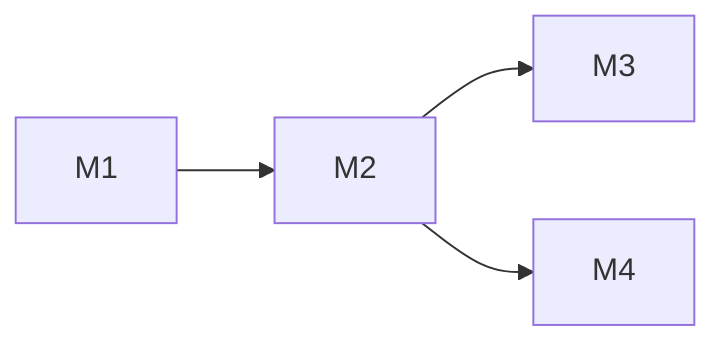

# <Project Name> — Blueprint

> 프로젝트의 전체 밑그림. 코드 작성 전 사용자 승인이 필수 (HARNESS HC-1, 모든 strictness 모드).

## 1. Goals & Non-goals

### Goals (무엇을 해결하는가)
- <목표 1 — measurable>
- <목표 2>

### Non-goals (의도적으로 안 하는 것)
- <non-goal 1 — 왜>
- <non-goal 2>

## 2. Constraints

| 종류 | 제약 |
|---|---|
| 기술 | <언어 / 런타임 / 호스팅 / 라이브러리 제약> |
| 비용 | <예산 / 토큰 / 컴퓨트> |
| 시간 | <데드라인 / 마일스톤> |
| 규제·법 | <PII / GDPR / 라이선스> |
| 인력 | <누가 어디까지> |

## 3. Modules

### Module M1 — <name>

- **Responsibility**: 한 문장
- **Interfaces**:
  - input: <data shape / endpoint / event>
  - output: <...>
- **Dependencies**: <다른 모듈 / 외부 서비스 / 시크릿(HC-7)>
- **Test strategy**: <unit / integration / e2e / 디버그 hook>
- **Owner**: claude-implementer (기본)

(필요한 만큼 M2, M3, ... 반복)

## 4. Dependency graph

```
M1 ──▶ M2 ──▶ M4
       │
       └──▶ M3
```

또는 mermaid:


> **사이클 금지** — 사이클이 있으면 모듈 분할 또는 이벤트화로 해소.

## 5. Test strategy (전체)

- **Unit**: <coverage 목표, fixture 전략>
- **Integration**: <어떤 boundary?>
- **E2E**: <시나리오 갯수 / 자동화 도구>
- **Manual / GUI**: <스크린샷 캡쳐 저장 위치 / 디버그 콘솔 출력 약속 / HIL 시뮬레이터 등>
- **재현성**: <시드 / 컨테이너 / fixtures>

## 6. Observability

- **Logging**: <구조화 로그 / 레벨 / redaction(HC-7)>
- **Metrics**: <어디로 / 무엇을>
- **Tracing**: <옵션>
- **디버그 hook**: <콘솔 메시지 / 화면 캡쳐 / breakpoint 약속>

## 7. Risks

| ID | risk | likelihood | impact | mitigation |
|---|---|---|---|---|
| R1 | <riskname> | low/med/high | low/med/high | <조치> |

## 8. Open questions (사용자 결정 필요)

- Q1: ...
- Q2: ...

## 9. 승인 체크

Blueprint 승인 시 다음을 확인:
- [ ] 모듈 갯수 ≥ 3 (Phase E dogfood 기준)
- [ ] 각 모듈 인터페이스 1줄 표현 가능
- [ ] 의존성 그래프에 사이클 없음
- [ ] 테스트 전략이 실행 가능
- [ ] HC-7/8/9 영향 항목 식별됨
- [ ] Open questions 모두 답 되었거나 명시적 deferred
